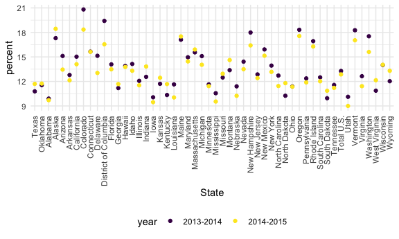
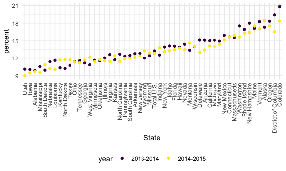

strings and factors
================
Rachel
10/25/2021

## Strings and regex

``` r
string_vec = c("my", "name", "is", "rachel")

str_detect(string_vec, "rachel")
```

    ## [1] FALSE FALSE FALSE  TRUE

``` r
str_replace(string_vec, "rachel", "Rachel")
```

    ## [1] "my"     "name"   "is"     "Rachel"

``` r
string_vec = c(
  "i think we all rule for participating", 
  "i think I have benn cought", 
  "i think this will be quite fun", 
  "it will be fun, i think"
)

str_detect(string_vec, "i think")
```

    ## [1] TRUE TRUE TRUE TRUE

``` r
string_vec = c(
  "i think we all rule for participating", 
  "i think I have benn cought", 
  "i think this will be quite fun", 
  "it will be fun, i think"
)

str_detect(string_vec, "^i think")      
```

    ## [1]  TRUE  TRUE  TRUE FALSE

``` r
str_detect(string_vec, "i think$")   
```

    ## [1] FALSE FALSE FALSE  TRUE

``` r
string_vec = c(
  "Y'all remember Pres. HW Bush?", 
  "I saw a green bush",
  "BBQ and Bushwalking at Molonglo Gorge",
  "BUSH -- LIVE IN CONCERT!!"
)

str_detect(string_vec, "bush")
```

    ## [1] FALSE  TRUE FALSE FALSE

``` r
string_vec = c(
  "Y'all remember Pres. HW Bush?", 
  "I saw a green bush",
  "BBQ and Bushwalking at Molonglo Gorge",
  "BUSH -- LIVE IN CONCERT!!"
)

str_detect(string_vec, "Bush")
```

    ## [1]  TRUE FALSE  TRUE FALSE

``` r
string_vec = c(
  "Y'all remember Pres. HW Bush?", 
  "I saw a green bush",
  "BBQ and Bushwalking at Molonglo Gorge",
  "BUSH -- LIVE IN CONCERT!!"
)

str_detect(string_vec, "[Bb]ush")
```

    ## [1]  TRUE  TRUE  TRUE FALSE

``` r
string_vec = c(
  '7th inning stretch',
  '1st half soon to begin. Texas won the toss.',
  'she is 5 feet 4 inches tall',
  '3AM - cant slee :('
)

str_detect(string_vec, "[0-9][a-zA-Z]")     
```

    ## [1]  TRUE  TRUE FALSE  TRUE

``` r
string_vec = c(
  'Its 7:11 in the evening', 
  'want to go to 7-11?',
  'my flight is AA711',
  'NetBios: scanning ip 203.167.114.66'
)

str_detect(string_vec, "7.11")
```

    ## [1]  TRUE  TRUE FALSE  TRUE

``` r
string_vec = c(
  'The CI is [2, 5]',
  ':-]',
  ':-[',
  'I found the answer on pages [5-7]'
)

str_detect(string_vec, "\\[")
```

    ## [1]  TRUE FALSE  TRUE  TRUE

## Factors

``` r
factor_vec = factor(c("male", "male", "female", "female"))

factor_vec
```

    ## [1] male   male   female female
    ## Levels: female male

## Factors

``` r
factor_vec = factor(c("male", "male", "female", "female"))

factor_vec
```

    ## [1] male   male   female female
    ## Levels: female male

## NSDUH

``` r
url = "http://samhda.s3-us-gov-west-1.amazonaws.com/s3fs-public/field-uploads/2k15StateFiles/NSDUHsaeShortTermCHG2015.htm" 

tabl_marj = 
  read_html(url) %>% 
  html_nodes(css = "table") %>% 
  first() %>% 
  html_table() %>%
  slice(-1) %>% 
  as_tibble()
```

``` r
data_marj = 
  tabl_marj %>% 
  select(-contains("P Value")) %>% 
  pivot_longer(
    -State,
    names_to = "age_year", 
    values_to = "percent"
  ) %>%
  separate(age_year, into = c("age", "year"), sep = "\\(") %>% 
  mutate(
    year = str_replace(year, "\\)", ""),
    percent = str_replace(percent, "[a-c]$", ""),
    percent = as.numeric(percent)
  ) %>% 
  filter(!(State %in% c("Total U.S", "Northeast", "Midwest", "South", "West")))
```

## NSDUH – factors

``` r
data_marj %>% 
  filter(age == "12-17") %>% 
  mutate(State = fct_relevel(State, "Texas", "Oklahoma")) %>% 
  ggplot(aes(State, y = percent, color = year)) +
  geom_point() +
  theme(axis.text.x = element_text(angle = 90, vjust = 0.5, hjust = 1))
```



``` r
data_marj %>% 
  filter(age == "12-17") %>% 
  mutate(State = fct_reorder(State, percent)) %>% 
  ggplot(aes(State, y = percent, color = year)) +
  geom_point() +
  theme(axis.text.x = element_text(angle = 90, vjust = 0.5, hjust = 1))
```


